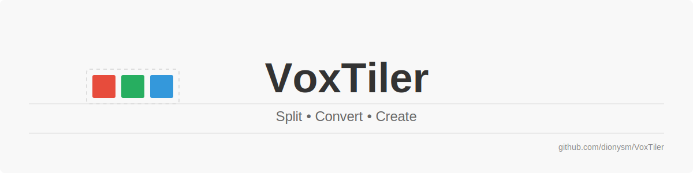

# VoxTiler


> [English Version](#english-version) | [Deutsche Version](#deutsche-version)

## English Version

A Python tool for splitting MagicaVoxel (.vox) files into smaller chunks and converting them to OBJ format for use in game engines like Godot.

### Features

- Split MagicaVoxel models along any dimension (X, Y, Z)
- Choose between fixed chunk sizes or dividing by a value
- Preserve original colors and palette
- Export to both MagicaVoxel (.vox) and Wavefront OBJ (.obj) formats
- Optimize OBJ output for game engines like Godot
- Simple command-line interface with interactive prompts

### Requirements

- Python 3.6+
- NumPy

### Installation

1. Clone this repository:
   ```
   git clone https://github.com/dionysm/VoxTiler.git
   cd voxtiler
   ```

2. Install required dependencies:
   ```
   pip install numpy
   ```

### Usage

Simply run the script and follow the interactive prompts:

```
python voxtiler.py
```

The tool will ask for:
1. Path to the input .vox file
2. Output directory
3. Splitting options (fixed size, division, or no splitting)
4. Output format (VOX, OBJ, or both)

### Example Workflow

1. Start with a large voxel model (e.g., 176x112x10)
2. Choose to split with fixed chunk size (e.g., 16x16x10)
3. The tool creates multiple 16x16x10 chunks, preserving the original colors
4. Use these chunks in your game engine

### Advanced Features

- Selectively split only certain dimensions
- Keep original dimensions for any axis
- Export the entire model without splitting
- Choose between VOX, OBJ, or both formats

### License

This project is licensed under the MIT License - see the LICENSE file for details.

---

## Deutsche Version

Ein Python-Tool zum Aufteilen von MagicaVoxel (.vox) Dateien in kleinere Stücke und zur Konvertierung in das OBJ-Format für die Verwendung in Game-Engines wie Godot.

### Funktionen

- Teile MagicaVoxel-Modelle entlang jeder Dimension (X, Y, Z)
- Wähle zwischen festen Chunk-Größen oder Teilung durch einen Wert
- Bewahre die originalen Farben und die Palette
- Exportiere in MagicaVoxel (.vox) und Wavefront OBJ (.obj) Formate
- Optimiere OBJ-Ausgabe für Game-Engines wie Godot
- Einfache Befehlszeilenschnittstelle mit interaktiven Eingabeaufforderungen

### Voraussetzungen

- Python 3.6+
- NumPy

### Installation

1. Klone dieses Repository:
   ```
   git clone https://github.com/dionysm/VoxTiler.git
   cd voxtiler
   ```

2. Installiere die erforderlichen Abhängigkeiten:
   ```
   pip install numpy
   ```

### Verwendung

Führe einfach das Skript aus und folge den interaktiven Eingabeaufforderungen:

```
python voxtiler.py
```

Das Tool fragt nach:
1. Pfad zur Eingabe-.vox-Datei
2. Ausgabeverzeichnis
3. Teilungsoptionen (feste Größe, Teilung oder keine Teilung)
4. Ausgabeformat (VOX, OBJ oder beides)

### Beispiel-Workflow

1. Beginne mit einem großen Voxel-Modell (z.B. 176x112x10)
2. Wähle die Teilung mit fester Chunk-Größe (z.B. 16x16x10)
3. Das Tool erstellt mehrere 16x16x10 Chunks und behält die Originalfarben bei
4. Verwende diese Chunks in deiner Game-Engine

### Erweiterte Funktionen

- Teile selektiv nur bestimmte Dimensionen
- Behalte Originaldimensionen für beliebige Achsen
- Exportiere das gesamte Modell ohne Teilung
- Wähle zwischen VOX, OBJ oder beiden Formaten

### Lizenz

Dieses Projekt ist unter der MIT-Lizenz lizenziert - siehe die LICENSE-Datei für Details.
